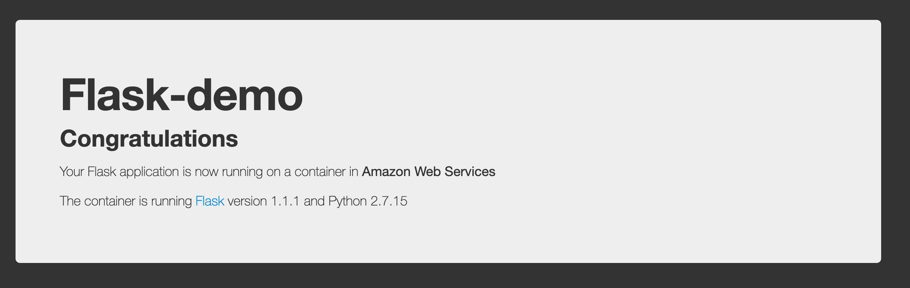
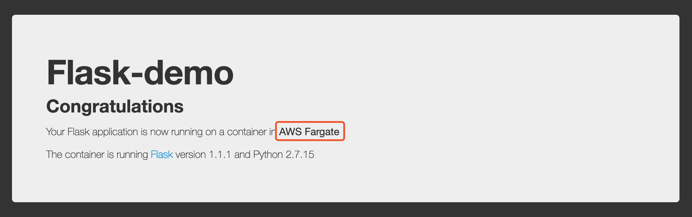

# Lab1

In this Lab, we walk you though building a basic nginx web app in AWS Fargate with AWS CDK in TypeScript.


### Install and Import required packages

```bash
$ cd Lab1
$ mkdir workspace
$ cd workspace
$ cdk init -l typescript
$ npm i @aws-cdk/aws-ec2
$ npm i @aws-cdk/aws-ecs
$ npm i @aws-cdk/aws-ecs-patterns
# open a new built-in terminal and run the following command in the background
$ npm run watch
```


edit `Lab1/workspace/lib/workspace-stack.ts`

```js
import cdk = require('@aws-cdk/core');
import ec2 = require('@aws-cdk/aws-ec2');
import ecs = require('@aws-cdk/aws-ecs');
import ecsPatterns = require('@aws-cdk/aws-ecs-patterns');

export class WorkspaceStack extends cdk.Stack {
  constructor(scope: cdk.Construct, id: string, props?: cdk.StackProps) {
    super(scope, id, props);
    
  }
}
```

### Create a new VPC

```js
import cdk = require('@aws-cdk/core');
import ec2 = require('@aws-cdk/aws-ec2');
import ecs = require('@aws-cdk/aws-ecs');
import ecsPatterns = require('@aws-cdk/aws-ecs-patterns');

export class WorkspaceStack extends cdk.Stack {
  constructor(scope: cdk.Construct, id: string, props?: cdk.StackProps) {
    super(scope, id, props);

    const vpc = new ec2.Vpc(this, 'NewVPC', {
      cidr: '10.0.0.0/16',
      natGateways: 1
    })
    
  }
}

```


### cdk synth and cdk deploy

```bash
# cdk synth to see the output
$ cdk synth
# cdk deploy now(this may take a few minutes to create a new VPC, subnets and NAT Gateway)
$ cdk deploy
```


### Complete the Code

```js
import cdk = require('@aws-cdk/core');
import ec2 = require('@aws-cdk/aws-ec2');
import ecs = require('@aws-cdk/aws-ecs');
import ecsPatterns = require('@aws-cdk/aws-ecs-patterns');

export class WorkspaceStack extends cdk.Stack {
  constructor(scope: cdk.Construct, id: string, props?: cdk.StackProps) {
    super(scope, id, props);

    const vpc = new ec2.Vpc(this, 'NewVPC', {
      cidr: '10.0.0.0/16',
      natGateways: 1
    })

    const cluster = new ecs.Cluster(this, 'Cluster', {
      vpc
    })

    const taskDefinition = new ecs.FargateTaskDefinition(this, 'Task', {
      memoryLimitMiB: 512,
      cpu: 256
    })

    const web = taskDefinition.addContainer('web', {
      image: ecs.ContainerImage.fromRegistry('nginx'),
    })

    web.addPortMappings({
      containerPort: 80
    })

    const svc = new ecsPatterns.ApplicationLoadBalancedFargateService(this, 'Svc', {
      cluster,
      taskDefinition
    })
  }
}

```


### cdk synth and cdk deploy

```bash
# cdk synth to see the output
$ cdk synth
# cdk deploy now(this may take a few minutes to create a new VPC, subnets and NAT Gateway)
$ cdk deploy
```


```
Outputs:
WorkspaceStack.SvcServiceURL1A95443A = http://Works-SvcLB-1F80U9TWVEQ88-1997255696.us-west-2.elb.amazonaws.com
WorkspaceStack.SvcLoadBalancerDNSEA316F6A = Works-SvcLB-1F80U9TWVEQ88-1997255696.us-west-2.elb.amazonaws.com

Stack ARN:
arn:aws:cloudformation:us-west-2:903779448426:stack/WorkspaceStack/0829f0f0-f07f-11e9-8471-06969188ef6e
```


Open the URL:


# Building the Flask App


Let's update the `image` property and point to local asset directory where our flask app is.

And update the port mapping to `5000` where is the default flask port.

```js
    const web = taskDefinition.addContainer('web', {
      // image: ecs.ContainerImage.fromRegistry('nginx'),
      image: ecs.ContainerImage.fromAsset('../flask-docker-app')
    })

    web.addPortMappings({
      // containerPort: 80
      containerPort: 5000
    })
```


### CDK Deploy

```bash
$ cdk deploy
```

This will take a while as cdk will `docker build` from local assets for you, pushing to Amazon ECR and update the Amaozn ECS with AWS Fargaet with the new docker image of Flask.



Let's update the container environment variable

```js
    const web = taskDefinition.addContainer('web', {
      // image: ecs.ContainerImage.fromRegistry('nginx'),
      image: ecs.ContainerImage.fromAsset('../flask-docker-app'),
      environment: {
        'PLATFORM': 'AWS Fargate'
      }
    })
```


And deploy again

```bash
# deploy again
$ cdk deploy
```




### Clean up

```bash
$ cdk destroy
```

